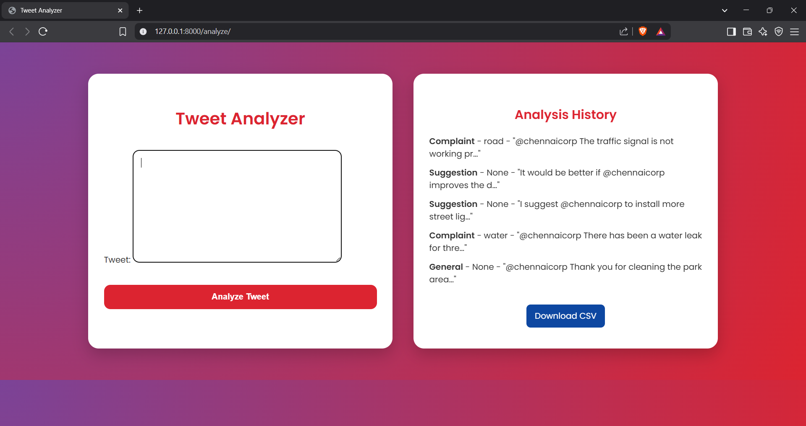
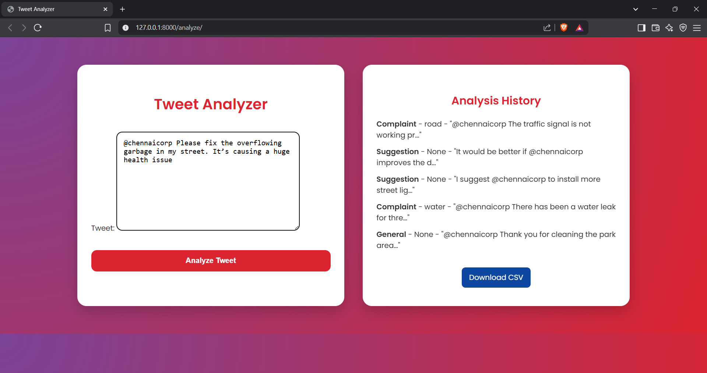
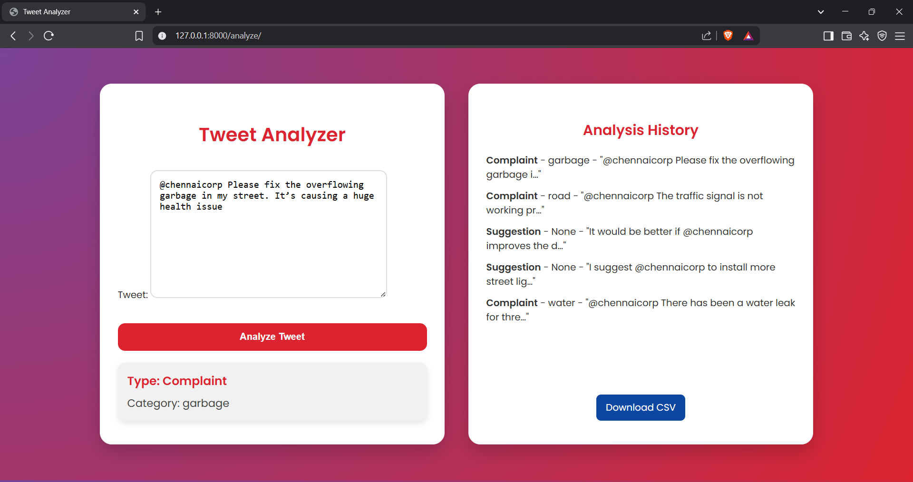
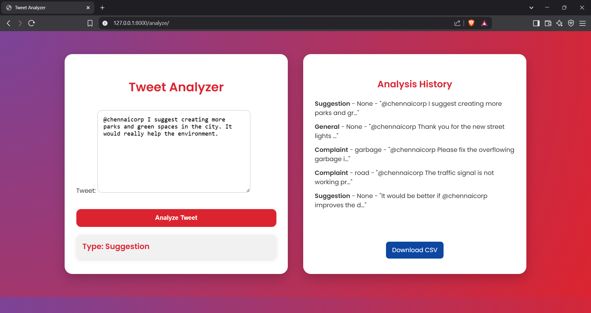
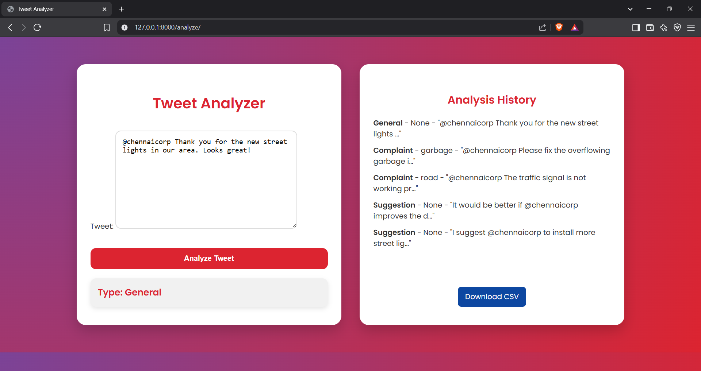

# 🐦 Twitter Complaint & Suggestion Analyzer (Django)
A web-based Tweet Analyzer built with Django and Python that classifies tweets mentioning @chennaicorp into Complaints or Suggestions, and further categorizes complaints (e.g., garbage, road, water issues, etc.).
## ✨ Features

## 🔍 Tweet Analysis
- Detect whether a tweet is a Complaint or Suggestion.
- Categorize complaints into:
  - 🚮 Garbage
  - 🚧 Road
  - 🚰 Water
  - ⚙️ General

## 👥 User Interface
- Clean and responsive UI to input tweets.

- Shows analysis results instantly.

- Displays recent analyzed tweets and their classifications.

## 📦 Optional Enhancements
- Stores analysis history in the database.
- Users can view recent complaint history
- Download CSV of all analysis for admin review..

## 🛠 Tech Stack
- Backend: Django (Python)
- Frontend: HTML, CSS, Bootstrap
- Database: SQLite
- Version Control: Git + GitHub

## 📸 Screenshots

### Home Page

---

### Tweet Input and Result Page

---

### Complaint_output

---

### Suggestion_output

---

### General_output

